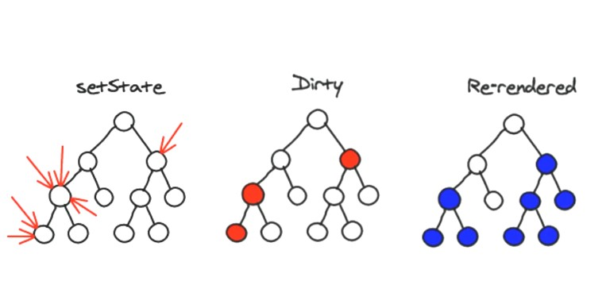
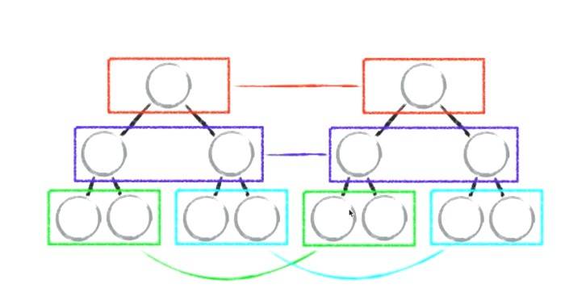
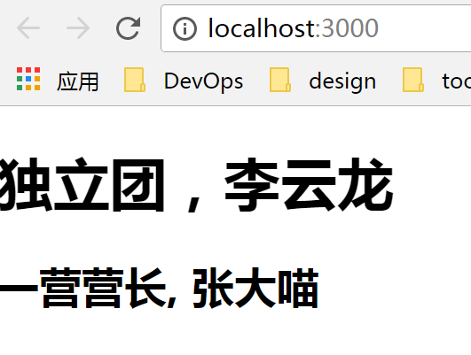

# React

## Introduction React

### What React

> 一个用于创建**可复用，可聚合** web 组件 UI 库
> 只提供前端 MVC(M:接口数据，C:React封装好了) 框架中的 V 层，并不是完整的 MVC 框架

- Facebook 出品，专注 View 层
- 一切皆组件
- 全部使用 ES6 语法(上线时基于Babel工具ES6编译成ES5)

### React History

- 2013-6, Facebook 官方发布 React
- 2014-9, React 热度开始上涨
- 2015-3，React Native 发布

### Why use React

Facebook 解决的问题：构建数据不断变化的大型应用

**数据**变换

大量 **DOM** 操作

**逻辑**极其复杂

- React
  - 自动 DOM 操作
  - 状态对应内容（状态<=>数据）

### React 版本

- React 16 核心代码重写的版本，整体 API 变化不大
- 主要变更了错误处理、生命周期、打包、对开发影响不是特别大
- `# npm install --save react@next react-dom@next`

### React 相关资源

- [awesome-react](https://github.com/enaqx/awesome-react)
- [babeljs](https://babeljs.io/)
- [兼容性](http://kangax.github.io/compat-table/es5/)
- [不同版本 JS CDN](https://cdnjs.com/libraries/react/)
- [NPMJS](https://www.npmjs.com/)

## 前段框架对比

### MVC

> Model View Controller

- Model(模型)：数据保存
- View(视图)：用户界面
- Controller(控制器)：业务逻辑


1. View 传送指令到 Controller
2. Controller 完成业务逻辑后，要求 Model 改变状态
3. Model 将新的数据发送到 View, 用户得到反馈
- 注意以上通信都是**单向的**

#### 互动模式

1. View 接受指令，传递给 Controller


2. Controller 接受指令，传递给 Model保存，并在 View 层展现


- Backbne.js 实例

 

1. 用户可以向 View 发送指令（DOM 事件），再由 View 直接要求 Model 改变状态。

2. 用户也可以直接向 Controller 发送指令（改变 URL 触发 hashChange 事件），再由 Controller 发送给 View。

3. Controller 非常薄，只起到路由的作用，而 View 非常厚，业务逻辑都部署在 View。所以，Backbone 索性取消了 Controller，只保留一个 Router（路由器）。

### MVP

> MVP 模式将 Controller 改名为 Presenter，同时改变了通信方向。


1. 各部分之间的通信，都是双向的。

2. View 与 Model 不发生联系，都通过 Presenter 传递

3. View 非常薄，不部署任何业务逻辑，称为"被动视图"（Passive View），即没有任何主动性，而 Presenter非常厚，所有逻辑都部署在那里。

### MVVM

> Model View ViewModel


- MVVM 模式将 Presenter 改名为 ViewModel，基本上与 MVP 模式完全一致。
- 唯一的区别是，它采用双向绑定（data-binding）：View的变动，自动反映在 ViewModel，反之亦然。Angular 和 Ember 都采用这种模式。

## React features

### 组件化

> 提高代码**复用率、降低测试难度和代码复杂度**

- 提高代码复用率：组件将**数据和逻辑封装**，类似面向对象中的类
- 降低测试难度：组件**高内聚低耦合**，很容易对单个组件进行测试
- 降低代码复杂度：直观的语法可以解答提高可读性

### JSX

> JS 逻辑与 HTMl 标签紧密相连并且极易理解. XML 语法扩展
> JavaSript XML 语法标记

相比JS输出html标记需要字符串并连接符进行输出

JSX 可以自定义标签

JSX 定义组件名必须以大写字母开头，小写字母开头是HTML标记

JSX 语法规定最外层标签必须有且只有一个标记。也可以Fragment标记作为片段标记

### 单向数据流

> 数据一旦更新，就直接重新渲染整个 app

### 虚拟 DOM 树

- React 重建 DOM 树
- 找到与上个版本的 DOM 的差异
- 计算出最新的 DOM 更新操作
- 从操作队伍中批量地执行 DOM 更新操作

- 在 Node.js服务器端运行
  - 服务器与客户端共用逻辑（lsomorphic javascript）
  - SEO 友好，便于生成缓存的单面应用
  - 直接渲染特定的页面而不用渲染整个 app

- 管理 UI 状态并不简单
  - 修改 DOM 树
  - 修改数据
  - 接收用户的输入
  - 异步 API 数据请求

1. state 数据
2. JSX 模板(render函数)
3. 数据 + 模板 结合，生成真实的 DOM 来显示
4. state 发生改变
5. 数据 + 模板 结合，生成真实的 DOM，替换原始的 DOM

- 缺陷：
  - 第一次生成了一个完整的DOM片段
  - 第二次生成了一个完整的DOM片段
  - 第二次的DOM替换第一次的DOM，非常耗性能

1. state 数据
2. JSX 模板
3. 数据 + 模板 结合，生成真实的 DOM 来显示
4. state 发生改变
5. 数据 + 模板 结合，生成真实的 DOM，并不直接替换原始的 DOM
6. 新的 DOM(DocumentFragment) 和原始的 DOM 做比对，找差异
7. 找出 input 框发生了变化
8. 只用新的 DOM 中的 input 元素，替换掉老的 DOM 中的 input 元素

缺陷：
系能的提升并不明显

1. state 数据
2. JSX 模板
3. 数据 + 模板 结合生成虚拟DOM (虚拟DOM就是一个 JS 对象，用它来描述真实 DOM)（损耗了性能）
  `['div', {id:'abc'}, ['span',{}, 'hello world']]`
4. 用虚拟DOM的结构生成真实的 DOM 来显示
  `<div><span id='abc'>hello world</span></div>`
5. state 发生变化

6. 数据 + 模板 生成新的虚拟DOM (极大提升了性能)
  `['div', {id:'abc'}, ['span',{}, 'bye bye']]`

7. 比较原始虚拟DOM和新的虚拟DOM的区别，找到区别是span中的内容

8. 直接操作DOM，改变 span 中的内容

**JSX -> createElement -> 虚拟DOM(JS 对象) -> 真实的 DOM**

`<div><span>item</span></div>` = `return React.createElement('div', {}, React.createElement('div', {}, 'item'));`

`return React.createElement('div', {}, React.createElement('div', {}, 'item'));` 底层创建虚拟DOM

### 虚拟优点

1. 性能提升了
2. 跨端应用得以实现 - React Native。虚拟DOM生成原生组件

### 虚拟 DOM 的 diff 算法



setState 异步函数，连续三次setState，合并成一次setState

同级比较



第一级别比较不同，不再继续比较。第一级别重新生成新的DOM节点树，替换原始节点树。缺点：其他级别相同DOM比较也会创建新的DOM，但是比比较每个节点的算法性能更好。


每个节点起个名字，这样比对时性能提升。如果一致可以进行复用。

index作为key不好的原因是，删除其中某个节点之后index会重新排序，这样原始节点的key与新节点没有对应关系，所以diff算法比较性能更差。一定不要使用index作为key。

使用稳定值得作为key值才是正确的。

## 渲染方式

- 传统方式
  - 浏览器请求页面
  - 服务器请求数据库
  - 将数据传给模板
  - 模板渲染页面
- React 的渲染方式
  - 用户输入
  - 从 API 获取数据
  - 将数据传给顶层组件
  - React 将每个组件渲染出来

## 脚手架

- vue: `vue-cli`
- react: `create-react-cli`

### create-react-cli

- 全局环境安装模块: `npm i -g create-react-app`
- 查看全局安装模块目录：`npm root -g`
- 查看模块八本：`create-react-app --version`

### 使用脚手架创建项目

> 项目命名规则：小写字母、数字和特殊字符(横线和下划线)

```sh
# create-react-app my-app
```

### 项目结构

- **node_modules** 当前项目中依赖的包
- **.bin** 本地项目可执行命令，在package.json的 scripts 中配置对应的脚本即可
  - `react-scripts`
- **public** 当前项目的HTML页面(单页面应用放一个index.html即可，多页面根据自己需求放置需要的页面)
  - `index.html`
    - 所有的逻辑都在JS中完成（包括页面结构的创建），如果给当前的页面导入CSS样式或者ImG图片等内容
      - 1. JS中基于 ES6 Module模块规范，使用 `import` 导入，这样 webpack在编译合并JS的时候，会把导入的资源文件等插入到页面的结构中（**绝对不能再JS管控的结构中通过相对目录**。例如：`./`或者`../` 导入资源，因为在 webpack 编译的时候，地址就不在是之前的相对地址）
      - 2. 不在JS中导入（JS中导入的资源最后都会基于Webpack编译），可以把资源手动的在HTML中导入，但是HTML最后也要基于Webpack编译，导入的地址也**不建议相对地址**，而是使用 `%PUBLIC_URL%` 写成绝对地址
        - `%PUBLIC_URL%` 等于 `public`目录
- **src** 组件、路由、CSS和图片源码目录
  - `index.js` 当前项目的主入口文件
- **.gitignore** git提交过程中忽略的文件或目录
- **package.json** 当前项目配置清单
  - **dependencies** 生产环境模块依赖
    - `react`
    - `react-dom`
    - `react-scripts` **集成了webpack等需要的内容**
      - Babel
      - CSS
      - ESlint
      - webpack
      - 没有 less/sass处理内容(需要时，自己额外的安装)
  - **devDependencies** 开发依赖模块
  - **scripts**
    - `start`： 开发环境下，基于 webpack 编译处理，最后可以预览当前开发项目成果（在webpack中安装了`webpack-dev-server`插件，基于这个插件会自动创建一个Web服务【端口号】默认是`3000`，webpack会自动打开浏览器并展示给我们，并且监听代码变化，自动重新编译，并且刷新浏览器来完成重新渲染）
    - `build`: 项目需要部署到服务器上，先执行 `yarn build`，把项目整体打包（完成后会在项目中生成一个build目录，这个目录中包含了所有编译后的内容，把这个上传到服务器即可）；而且在服务器上进行部署的时候，不需要安装任何模块（Webpack已经打包编译了）
  - **eject**

### 项目开发流程

1. `reset.css` 重置样式文件存放到 `public/css` 目录下；打开 `public/index.html` 文件在`head`标签中插入如下代码`<link rel="stylesheet" href="%PUBLIC_URL%/css/reset.min.css">`；此处必须webpack编译之后打开页面生效

### 脚手架深入剖析

- `create-react-app` 脚手架把安装的`webpack`及配置文件集成在`react-script`模块中，放到了`node_modules`目录中
- 生产环境项目中，需要在脚手架默认安装的基础上，额外安装一些其他需要的模块，例如：`react-router-dom/axios/less/less-loader`
  - 情况一(`react-router-dom/axios`)：我们安装其他的组件，但是安装成功后不需要修改webapck的配置项，此时直接的安装，并且调取使用即可。
    - 举例：
      `yarn add qs` 之后`"dependencies": {"qs": "^6.7.0"`
      - src/index.js 中导入`qs`
        - `import qs from 'qs'`
        - `console.log(qs.parse('name=wovert&age=10&type=teacher'))`
  - 情况二(`less/less-loader`)：安装的插件基于webpack处理的，也就是需要把安装的模块配置到webpack中（重新修改webapck配置项）
    - (1) 首先需要把隐藏的`node_modules`中的配置项暴露到项目中
      - `yarn eject` 指向之后不可逆
        - 1)首先确认执行eject操作，这个操作不可逆，一旦暴露出来配置项，就无法再隐藏回去
        - 2)当前的项目 **git** 管理，在执行`eject`的时候，没有提交到历史去的内容，需要先提交到历史区，然后再 `eject` 才可以，否则报错
    - (2) 再次修改对应的配置项即可
      - 暴露后，项目目录多个两个目录
        - **config** webpack配置文件
          - **webpack.config.dev.js** 开发环境下的配置项(`yarn start`)
          - **webpack.config.prod.js** 生产环境下的配置项(`yarn build`)
        - **scripts** 可执行脚本的JS文件
          - **start.js** `yarn start` 执行的就是这个JS
          - **build.js** `yarn build` 执行的就是这个JS
        - **package.json** 中的内容修改
    - 举例：
      - (1) `vim src/static/less/index.less`
        - `@color: lightblue;`
        - `html, body { height: 100%; overflow: hidden; background:@color}`
      - (2) `vim src/index.js`
        - `import from './static/less/index.less`
      - (3) 预览项目的时候，也是先基于webpack编译，把编译后的内容放到浏览器中运行，所以项目中使用**less**，需要修改webpack配置项，在配置项中加入less的编译工作，这样后期预览项目，首先基于**webpack把less编译为css**，然后在呈现在页面中
        - 1)`yarn add less less-loader`
        - 2)`less`在开发和生产环境都需要配置的
          - `vim config/webpack.config.js`

```js
            const lessRegex = /\.less$/;
            const lessModuleRegex = /\.module\.less$/;
            {
              test: lessRegex,
              exclude: lessModuleRegex,
              use: getStyleLoaders(
                {
                  importLoaders: 2,
                  sourceMap: isEnvProduction && shouldUseSourceMap,
                },
                'less-loader'
              ),
              sideEffects: true
            },
            {
              test: lessModuleRegex,
              use: getStyleLoaders(
                {
                  importLoaders: 2,
                  sourceMap: isEnvProduction && shouldUseSourceMap,
                  modules: true,
                  getLocalIdent: getCSSModuleLocalIdent
                },
                'less-loader'
              )
            },
```
        - `set HTTPS=true&&set PORT=3443&&yarn start` 开启https协议模式（设置环境变量HTTPS的值）

## react & react-dom

- **渐进式框架**：流行的框架设计思想，一般框架中包含很多内容，这样导致框架的体积过于臃肿，拖慢加载速度。实际项目中，我们使用一个框架，不一定用到所有的功能，此时应该把框架的功能进行拆分，用户想要什么，让其自己自由组合即可。
- 全家桶：渐进式框架N多部分的组合
- **VUE全家桶**：vue-cli/vue/vue-router/vuex/axios(fetch)/vue element(vant)
- **REACT全家桶**：create-react-app/react/react-dom/react-router-dom/redux/react-redux/axios/ant/dva/saga/mobx
  - **react**: react框架的核心部分，提供了Component类可以进行**组件开发**，提供**钩子函数**（生命周期函数：所有的声明周期函数都是基于回调函数完成的）
  - **react-dom**：把JSX语法渲染为真实DOM（能够放到页面中展示的结构都叫做真实的DOM）的组件
    - `ReactDOM.reander([JSX], [CONTAINER], [CALLBACK])` 把JSX元素渲染到页面中
      - JSX：React虚拟元素
      - CONTAINER：容器，想把元素放到页面中的那个容器中
      - CALLBACK: 当把内容放到页面中呈现触发的回调函数

## React 是如何使用 JSX

> JSX: React独有的语法，JavaScript+XML = JSX

- (1)不推荐把JSX直接方法哦body中，而是放在自己创建一个容器中，一般我们都放在一个ID为ROOT的div中即可 `ReactDOM.render(<div id="box">Hello {data}</div>), document.querySelector('#root'), ()=> { let oBox=document.querySelector('#box'); console.log(oBox.innerHTML)})`
- (2)JSX 中出现的`{}`是存放JS代码，但是要求JS代码执行完成需要有返回结果（JS表达式）
  - 不能直接放一个对象数据类型的值（`对象(除了给style赋值)`、`数组`（数组中没有对象都是基本值或者是JSX元素是可以的）、`函数`都不行）
  - 可以是基本数类型的值(`布尔类型`什么都不显示、`null`、`undefined`也是JSX元素，代表的是空)
  - 不支持循环判断语句，但是支持**三元运算符**
- (3)当前循环数组创建 JSX 元素（一般都是基于数组的`MAP`方法完成迭代），需要给创空的元素设置唯一的 `KEY` 值（当前本次循环内唯一即可）
- (4)只能出现一个根元素
- (5)给元素设置样式类用的是 `className` 而不是 `class`
- (6)style属性中不能直接写样式字符串，而是基于一个样式对象来遍历赋值

```js
let data = [
  {
    name: 'wovert',
    age: '10'
  },
  {
    name: 'lingyima',
    age: '18'
  }
]

export default class App extends Component {
  render() {
    return (
      <div className="App">
        <header className="App-header">
          boolean: {true}<br />
          null: {null}<br />
          undefined: {undefined}<br />
          {
            data.map((item, index) => {
              let {name, age} = item
              return <span key={age}>{name}</span>
            })
          }
          
          <p>
            Edit <code>src/App.js</code> and save to reload.
          </p>
        </header>
      </div>
    );
  }
}
```

``` js
<p className="hello">Hello {this.props.name}</p>
// 将编译成 React 构造器的方法
React.createElement("p", {className: "hello", "hello ", this.props.name})
```

## JSX 渲染机制

- (1) 基于babel中的语法解析模块**babel-preset-react** 把 JSX语法编译为 `React.createElement(...)` 结构
  - presets
    - state-0 提案(能不能成功不知道)
    - stage-1 审议(已经审核)
    - stage-2 草案(没有规范，但等于正式)
    - stage-3 正式发布
    - react
- (2) 执行`React.createElement(type, props, children)` 创建一个对象（虚拟DOM）
  - type: 'h1'
  - props: {id: '', className: '', style: '', children: ''}
  - ref: null
  - key: null
- (3) ReactDOM.render(JSX语法最后生成的对象，容器)，基于render方法把生成的对象动态创建为DOM圆度，插入到指定的容器中

 ## React 基础语法

- `import React`
- `class` 语法新建组件，`render`里直接使用
- `render` 函数返回值就是输出 JSX 语法，会把 JSX 转换成 JS 执行

### JSX 语法代码

``` js
function hello(props){
  return <h1>Hello, {props.老大}</h1>
}
```

### JSX 转后的 JS代码

``` js
"use strict";
function hello(props) {
  return React.createElement(
    "h1",
    null,
    "hello, ",
    props.老大
  )
}
```

### JSX 基础语法

> View 层语法

- js 里直接写 html
- class 写成 className
- 变量用{}包裹即可


### 组件之间传递数据

> 组件之间用 props 传递数据

- 使用 `<Component data="values">` 的形式传递
- 组件里使用 `this.props` 获取值
- 如果组件只有 `render`函数，还可以用函数的形式写组件




函数也可以作为组件


## 组件内部 state

> 组件内部通过 state 管理状态

- JSX 本质就是 js,所以直接`数组.map` 渲染列表
- `Constructor` 设置初始状态，记得执行`super(props)`
- State 是`不可变得对象·，使用 `this.state` 获取


## 事件

### 响应式设计思想和事件绑定

绑定事件命名必须驼峰是命名

- onClick 点击事件
  - JSX 里，`onClck={this.函数名}`来绑定事件
  - this 引用问题，需要在`构造函数里用 bind 绑定 this`
  - `this.setState` 修改 state, 记得`返回新的 state`，而`不是修改`


### immutable

> state 不许允做任何的改变，所以拷贝数据然后再赋值

### 拆分组件与组件之间的传值

- 父组件通过组件属性向子组件传递值，子组件通过`this.props.属性名`
- 子组件向父组件传递值
- key放在循环层的最外层

- 声明式开发
- 可以与其他框架共存
- 组件化
- 单项数据流
  - 父组件传递状态数据给子组件，子组件只能只读，不能写入。但是，可以在子组件中通过调用父组件方法修改父组件的状态数据
- 视图层框架(ReactJS)
- 函数式编程
- 数据框架层(Redux/Flusk)

### Reactdevelopertools 安装及使用

### PropTypes VS DefaultProps

校验父组件传递的属性值

### props，state与render函数的关系

React是数据驱动

当props和stats值改变的时候执行render函数

render函数重新获取新的值进行渲染

数据发生变化，页面就会发生变化

### 子组件重新渲染方式

> 当state或props值改变时，它的render函数会重新运行执行

1. 父组件传给子组件传递父组件state数据改变时，子组件render函数会运行
2. 当父组件的render 函数被运行时，它的子组件的render 函数都被重新运行一次

## React 生命周期

> React 组件有若干个钩子函数，在组件不同的状态执行

- 初始化周期
- 组件重新渲染生命周期
- 组件卸载声明周期


- 父组件: 输入命令并下达作战命令, `refs 属性`可以轻易获取　DOM　属性值


-------


未下达命令之前：声明周期流程


下达攻击平安县城命令之后：声明周期流程


### 在某一时刻组件会自动调用执行函数


- initalization 初始化触发
  - setup props state

- Mounting 组件挂载时触发
  - componentWillMount 组件即将被挂载到页面的之前仅自动执行一次(挂载之前)
  - render 渲染组件
  - componentDidMount 组件被挂载到页面之后仅自动被执行一次(已经挂载)

- Updation 组件更被时触发
  - props (props发生变化)
    - componentWillReceiveProps
      - 一个组件要从父组件接受参数
      - 如果这个组件第一次存在于父组件中，不会执行
      - 如果这个组件之前已经存在于父组件中，才会执行

    - shouldComponentUpdate 组件被更新之前，它会自动被执行。必须返回boolean是否继续往下执行其他事件。
      - return false; 组件不会被更新
      - return true; 组件会被更新

    - componentWillUpdate 组件被更新之前，自动执行
      - shouldComponentUpdate返回false,componentWillUpdate不会被执行
      - shouldComponentUpdate返回true,componentWillUpdate会被执行
    - render 更新渲染组件
    - componentDidUpdate 组件被更新之后，自动执行
  
  - states (states发生变化)
    - shouldComponentUpdate (true向下)
    - componentWillUpdate
    - render
    - componentDidUpdate

- Unmounting
  - componentWillUnmount 当这个组件即将被页面中剔除的时候，会被执行

``` js
// 第二次开始接收参数并更新子组件
shouldComponentUpdate TodoList.js:29
componentWillUpdate TodoList.js:33
render TodoList.js:40
child [componentWillReceiveProps] TodoItem.js:12
child shouldComponentUpdate TodoItem.js:21
child componentWillUpdate TodoItem.js:25
child componentDidUpdate TodoItem.js:28
componentDidUpdate
```

``` js
// 删除子组件
shouldComponentUpdate TodoList.js:29
componentWillUpdate TodoList.js:33
render TodoList.js:42
child [componentWillUnmount] TodoItem.js:31
componentDidUpdate
```

注意：render函数必须存在

## 安装 React Developer Tools

## antd-mobile 组件

`# npm i antd-mobile@next --save`

### 按需加载

- 安装按需加载模块 `# npm i babel-plugin-import --save`

``` shell
修改配置文件
# vim package.json
  "babel": {
    "presets": [
      "react-app"
    ],
   "plugins": [
     ["import", { "libraryName": "antd-mobile", "style": "css" }]
  ]
}
```

``` js
// 隐藏导入样式文件
import 'antd-mobile/dist/antd-mobile.css'
```

## 案例-亮剑

Windows OS use Administrator commands

``` shell
# npm i -g create-react-app
# create-react-app -v
# create-react-app liangjian
# cd liangjian && ls -l
# npm start
```

## Redux

> 状态管理库

### React 弊端

> 组件之间的传递数据


一个组件改变 store 之后，其他组件感知到store的数据变化自动更新最新store的数据，间接的实现了组件的传递的功能

### Redux 是什么

Redux = Reducer + Flux

Flux(de)) 升级成为 Redux

Reducer 概念

### Redux 工作流程

[redux flow](./images/redux-flow.png)

redux把所有数据放到store之中，每个组件从store中拿数据,而每个页面上的组件都更新store中的数据。Store是存储数据的公共区域。

- React Components: 借书的用户
- Action Creators: 你要借什么书的话
- store: 图书管的管理员
- Reducers: 借书记录本

如果要从 React Components组件中获取Store的数据，然后告诉Action creators 我要获取数据行为，Action Creators 创建获取数据的告诉store，store接收到action之后，在 reducers里查找相应的数据。Reducers告诉store你应该给组件什么样的数据。store知道之后把数据给了组件。

### Redux 特性

- 状态管理，和 React　解耦
- 单一状态，单项数据流
- 核心概念：store, state, action, reducer

### 独立团项目

- 独立团逐渐发展，老李发现管不过来了
  - 人少的时候，无论是兵器还是人员的变更，都是 setState
  - 发展为千人大团后，老李决定，军事生活分开
  - 所有状态归赵政委(redux)管理，自己只打仗（view显示）

- 老赵主要功能
  - 老赵有一个保险箱(store)所有人的状态，在那里都有记录(state)
  - 需要改变的时候，需要告诉专员(dispatch)要干什么(action)
  - 处理变化的人（reducer）拿到 state 和 action ,生成新的记录（state）

### 走马上任

1. 首先通过 reducer 新建 store, 随时通过 store.getState 获取状态
2. 需要状态变更，store.dispatch(action) 来修改状态
3. Reducer 函数接受state和action，返回新的state, 可以用 store.subscribe 监听每次修改

### 安装 redux

``` sh
# npm install redux -S
# vim src/index.js
```

```js
import { createStore } from 'redux';
// 2. 根据老的state 和 action 生成新的state
function counter($state = 0, action) {
  switch(action.type) {
    case '加机关枪':
      return state + 1;
     case '减机关枪':
       return state - 1;
    default:
      return 10;
  }
}

// 1. 新建 store
const store = createStore(counter);

// 3. 获取状态
const init = store.getState();
console.log(init);
function listener() {
  const current = store.getState();
  console.log(`现在有机枪${current}`);
}
// 4. 订阅 listener - 每次dispatch都会触发listener
store.subscribe(listener);

// 5. 派发事件,传递 action
store.dispatch({type: '加机关枪'});
store.dispatch({type: '加机关枪'});
store.dispatch({type: '减机关枪'});
```


### Redux 如何和 React 一起用

- 手动连接，老赵怎么管理独立团
  - 把 store.dispath 方法传递给组件，内部可以调用修改状态
  - Subscribe 订阅 render 函数，每次修改都重新渲染
  - Redux 相关内容，移到单独的文件 index.redux.js 单独管理


### 处理异步、调试工具、更优雅的和 React 结合

- Redux 处理异步，需要 `redux-thunk` 插件
- 安装调试工具 `npm install redux-devtools-extension` 并且开启
- 使用 `react-redux` 优雅的链接 react 和 redux

### redux-thunk 插件处理异步

``` sh
# npm i redux-thunk -S
# npm i redux-logger -S

使用 applyMiddleware 开启thunk中间件
Action 可以返回函数，使用 dispatch 提交 action

# npm i redux-devtools-extension -S
# npm i redux-chunk -S
```

index.js (applyMiddleware 处理中间件)

``` js
import { createStore, applyMiddleware} from 'redux'
const store = createStore(counter, applyMiddleware)
```


### 调试工具 redux-devtools-extension 配置

- 新建 `store` 的时候判断 `window.devToolsExtension`
- 使用 `compose` 结合 `thunk` 和 `window.devToolsExtension`
- 调试窗的 `redux` 选项卡，实时看到 `state`

``` js
import { createStore, applyMiddleware, compose } from 'redux';
const store = createStore(counter, compose(
  applyMiddleware(thunk),
  window.devToolsExtension ? window.devToolsExtension():f=>f;
))
```

### 使用 react-redux

- 老赵能力用起来很麻烦，为了方便管理，使用魏和尚来负责链接
- `npm i react-redux -S`
- 忘记 subscribe，记住reducer，action和dispatch 即可
- React-redux 提供 Provider 和 connect 两个接口来链接

- react-redux 具体使用
  - Provider 组件在应用最外层，传入 store 即可，只用一次
  - Connect 负责从外部获取组件需要的参数
  - Connect 可以用装饰器的方式来写
    - 使用装饰器优化 connect 代码 `npm run eject` 弹出个性化配置

1. 安装 `npm i babel-plugin-transform-decorators-legacy` 插件

2. Package.json 里babel 加上 plugins 配置

``` js
"babel": {
  "presets": [
    "react-app"
  ],
  "plugins": [
     "transform-decorators-legacy"
  ]
}
```

3. 修改 connect

``` js
const mapStateProps = (state) => {
  return { num: state };
}
const actionCreator = { addGun, removeGun, addGunAsync };
// app 组件接受外部参数
App = connect(mapStateProps, actionCreator)(App);
```

修改为

``` js
@connect(
  // 要 state 什么属性放到 props
  state => ({ num: state }),
  // 要什么方法，放到 props里，自动dispatch
  { addGun, removeGun, addGunAsync }
)
class App extends React.Component {...}
```


## Redux-router4

- React 官方推荐路由库，4是最新版本
  - Redux-router4 是最新的版本，和之前版本不兼容，浏览器和 RN 均兼容
  - React 开发单页应用必备，碱性路由即组件的该概念
  - 核心概念：
    - 动态路由
    - BrowserRouter: 浏览器路由
    - Route: 路由匹配组件渲染
    - Link: 指定页面跳转地址 to="地址"
    - Switch: 只渲染第一个Route
    - Redirect: 页面跳转到指定位置

### 安装 [react-router](https://reacttraining.com/react-router/)

- `npm i react-router-dom -S`
- **Router4** 使用 `react-router-dom` 作为浏览器的路由
- 忘记 **Router2**  的内容，拥抱最新的 Router4

### 组件

- `BrowserRouter` 包括整个应用
- `Route`r 路由对应渲染的组件，可嵌套
- `Link` 跳转专用

``` js
// 多页应用
import { BrowserRouter, Route, Link, Redirect, Switch } from 'react-router-dom'
import App from './App'
import Yiying from './Yiying'
import Qibinglian from './Qibinglian'
import Test from './Test'
ReactDOM.render(
  (<Provider store={store}>
    <BrowserRouter>
      <nav>
        <ul>
          <li><Link to="/">团部</Link></li>
          <li><Link to="/yiying">一营</Link></li>
          <li><Link to="/qibinglian">骑兵连</Link></li>
        </ul>
        <Switch>
          {/*Switch: 只渲染第一个Route*/}
          <Route path="/" exact component={App}></Route>
          <Route path="/yiying" component={Yiying} boss="张大喵"></Route>
          <Route path="/qibinglian" component={Qibinglian} boss="孙德胜"></Route>
          <Route path="/:location" component={Test}></Route>
          {/*不管访问什么页面都会跳转到首页*/}
          {/* <Redirect to='/'></Redirect> */}
        </Switch>
      </nav>
    </BrowserRouter>
  </Provider>),
  document.getElementById('root')
)
```

- 跳转到 /

``` js
  this.props.history.push('/')
```

### 其他组件

- `url` 参数，`Router` 组件参数可用冒号标识参数
- `Redirect` 组件跳转
  - `<Redirect to="/"></Redirect>`
- `Switch` 只渲染一个子 `Route` 组件


## 前后端联调

### 使用 asios 发送异步请求

- 如何发送,端口不一致,使用 `proxy` 配置转发
- **axios** 拦截器, 统一 loading  处理
- **redux** 里使用异步数据,渲染页面

### axios

> 简洁好用的发送请求库

- 调用接口放在`componentDidMount`生命周期函数
- 安装第三方模块：`npm i axios --save`
- 启动 mongod 服务: `mongod.exe --dbpath C:\usr_local\MongoDB\data --port 9093`

``` js
import axios from 'axios'
componentDidMount() {
  // 调用接口
  axios.get('/api/todolist')
    .then((data)=>{ alert('success');console.log(data); })
    .catch(()=>{ alert('faire')  })
}
```

``` sh
# vim package.json
  {
    "proxy": "http://localhost:9093"
  }
```

Auth.js

``` js
import axios from 'axios'
class Auth extends React.Component {
  constructor() {}
  componentDidMount() {
    axios.get('/data')
      .then(res=>{
        if (res.status == 200) {
          this.setState({
            data: res.data
          })
        }
      })
  }
}
```

## jspm

> Package Manager

- 语言包：npm, github
- Traceur
- Babel
- 发布应用：bundle

- SystemJS 加载 js 模块
  - AMD
  - CommonJS
  - ES6

### setup jspm

- 全局安装：`# npm install jspm -g`
- 创建项目：`# mkdir frontend && cd frontend`
- 初始化项目：`# npm init`
- 安装 jspm : `# npm i jspm --save-dev`
- 配置 jspm : `# jspm init`
  - `config.js` 是jspm 配置文件
  - `jspm_packages` jspm安装的包目录

- jspm会 动态的载入 babel 工具

### jspm install package

- 修改报名位jquery components 是仓库拥有者， jquery 仓库的名字

`# jspm install jquery=github:components/jquery`

- config.js

### jspm uninstall package

`# jspm uninstall jquery`

- https://github.com/jspm/registry 的package.json 有jquery， 通过一下方式安装

- `jspm install jquery` 安装最新的版本
- `jspm install jquery@^2.1.0`
- `jspm install jquery@~2.1.0`

### 使用ES6模块, BrowserSync 使用

1. `npm install -g browser-sync` 安装 Node 后，通过npm安装BrowserSync(自动刷新)

2. 使用BrowserSync： `browser-sync start --server` 开启服务

`browser-sync start --server --no-notify --files 'index.html, app/**/*.js'`

### 打包bundle 功能

``` sh
# jspm bundle app/main app/build.js  将app文件夹下的main.js里面的js都打包到build.js中
# jspm bundle app/main app/build.js --inject 这样不用在html 引入build.js文件
```

### jspm 安装 react

``` sh
# jspm install react
# jspm install react@0.14.0-rc1

# jspm install react-dom
# jspm install semantic-ui
# jspm install css
```

监视服务器文件的变化

``` sh
# browser-sync start --server --no-notify --files 'index.html, app/**/*.js'
```

## bower 包管理

- `# npm install -g bower`
- `# bower install react`

## React 的 CSS 过度动画

[react-transition-group](https://github.com/reactjs/react-transition-group) 第三方模块

`npm install react-transition-group --sav`

动画会移除DOM元素

### 初始化项目

``` js
// 引入包
import React from 'react';
import ReactDOM from 'react-dom';

// all in js (JS引入css文件)
import './index.css';

// 引入自定义组件
import App from './App';

// PWA progressive web application
// https协议的服务器上，第一次访问之后，第二次访问时断网，依赖可以访问之前访问的页面
import registerServiceWorker from './registerServiceWorker';

// App组件挂载到id为root节点上
// <App /> 是JSX语法需要引入react
ReactDOM.render(<App />, document.getElementById('root'));
registerServiceWorker();
```

``` js
import React from 'react';
const Component = React.Component;

import React,{Component} from 'react';
```

使用了**JSX语法**必须引入**react包**