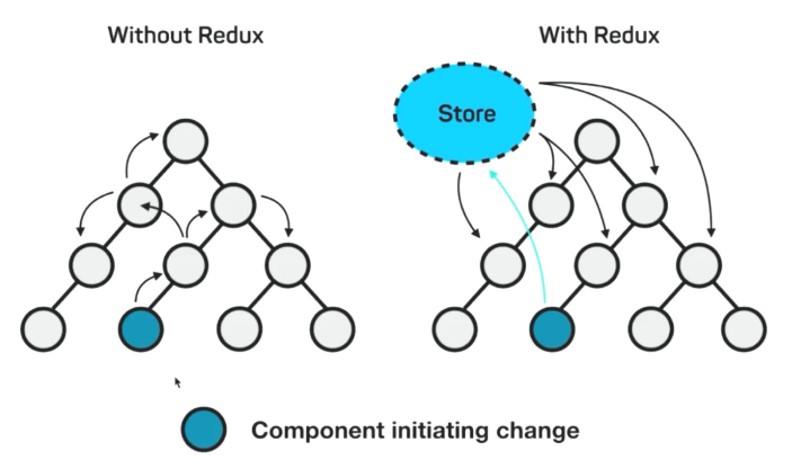
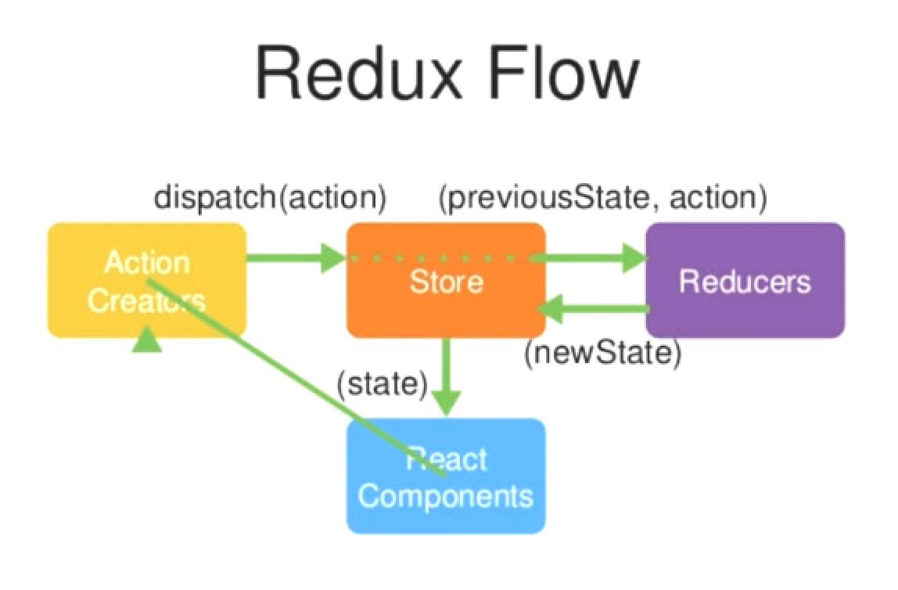
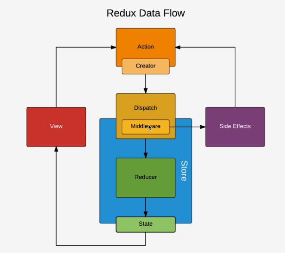
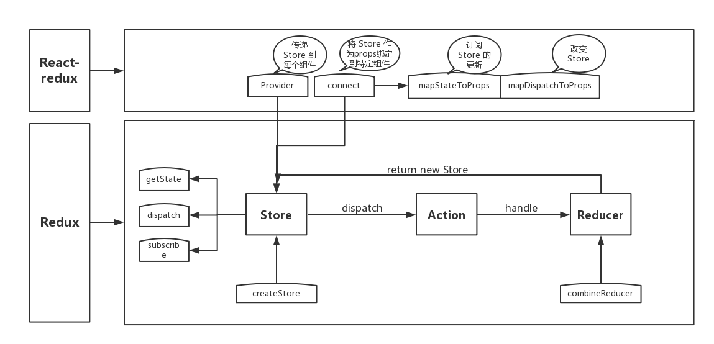

# redux

## React 弊端

> 组件之间的传递数据




一个组件改变 store 之后，其他组件感知到store的数据变化自动更新最新store的数据，间接的实现了组件的传递的功能

## Redux 是什么

- Redux = Reducer + Flux
- Flux(de)) 升级成为 Redux
- Reducer 概念

## Redux 特性

- 状态管理，和 React　解耦
- 单一状态，单项数据流
- 核心概念：store, state, action, reducer

## redux 应用场景

> 多交互、多数据源

- 某个组件的状态共享
- 某个状态需要在任何地方都可以拿到
- 一个组件需要改变全局状态
- 一个组件需要改变另一个组件的状态

### 举例 redux 应用场景

- 用户的使用方式复杂
- 不同身份的用户有不同的使用方式（比如普通用户和管理员）
- 多个用户之间可以协作
- 与服务器大量交互，或者使用了WebSocket
- `View` 要从多个来源获取数据

如果不使用 Redux 或者其他状态管理工具，不按照一定规律处理状态的读写，代码很快就会变成一团乱麻。你需要一种机制，可以在**同一个地方查询状态、改变状态、传播状态的变化**。

Redux 只是 Web 架构的一种解决方案，也可以选择其他解决方案。

## 设计思想

1. Web 应用是一个状态机，视图与状态是一一对应的
2. 所有的状态，保存在一个对象里面

## API

### Store

> 保存数据的地方或者一个容器。整个应用只能有一个 Store

Redux 提供`createStore`这个函数，用来生成 `Store`。

```js
import { createStore } from 'redux'
const store = createStore(fn) // 创建store容器
```

上面代码中，`createStore`函数接受另一个函数作为参数，返回新生成的 Store 对象

### State

> Store对象包含所有数据，想得到某个时点的数据，就要对 Store 生成快照。这种**时点的数据集合**，就叫做 State

获取当前时刻的 State：`store.getState()`

```js
import { createStore } from 'redux';
const store = createStore(fn);
const state = store.getState();
```

Redux 规定， **一个 State 对应一个 View**。**只要 State 相同，View 就相同**。你知道 State，就知道 View 是什么样，反之亦然。

### Action

> State 的变化，会导致 View 的变化。但是，用户接触不到 State，只能接触到 View。所以，State 的变化必须是 View 导致的。Action 就是 View 发出的通知，表示 State 应该要发生变化了

`Action` 是一个对象。其中的`type`属性是必须的，表示 `Action` 的名称。其他属性可以自由设置，社区有一个规范可以参考。

```js
const action = {
  type: 'ADD_TODO',
  payload: 'Learn Redux'
}
```

上面代码中，`Action` 的名称是`ADD_TODO`，它携带的信息是字符串`Learn Redux`。

可以这样理解，`Action` **描述当前发生的事情**。改变 State 的唯一办法，就是使用 `Action`。它会运送数据到 `Store`。

### Action Creator

> View 要发送多少种消息，就会有多少种 Action。如果都手写，会很麻烦。可以定义一个函数来生成 Action，这个函数就叫 Action Creator。

```js
const ADD_TODO = '添加 TODO';

// Action Creator
function addTodo(text) {
  return {
    type: ADD_TODO,
    text
  }
}

const action = addTodo('Learn Redux');
```

### store.dispatch()

`store.dispatch()`是 `View` 发出 `Action` 的唯一方法。

```js
import { createStore } from 'redux'
const store = createStore(fn)

store.dispatch({
  type: 'ADD_TODO',
  payload: 'Learn Redux'
})
```

`store.dispatch`接受一个 `Action` 对象作为参数，将它发送出去。

结合 `Action Creator`，这段代码可以改写成 `store.dispatch(addTodo('Learn Redux'))`

### Reducer

> Store 收到 Action 以后，必须给出一个新的 State，这样 View 才会发生变化。这种 State 的计算过程就叫做 Reducer。

`Reducer` 是一个函数，它接受 `Action` 和当前 `State` 作为参数，返回一个`新的 State`。

```js
const reducer = function (state, action) {
  // ...
  return new_state
}

// 整个应用的初始状态，可以作为 State 的默认值
const defaultState = 0
const reducer = (state = defaultState, action) => {
  switch (action.type) {
    case 'ADD':
      return state + action.payload
    default:
      return state
  }
}

const state = reducer(1, {
  type: 'ADD',
  payload: 2
})
```

上面代码中，`reducer`函数收到名为`ADD`的 `Action` 以后，就返回一个新的 `State`，作为加法的计算结果。其他运算的逻辑（比如减法），也可以根据 Action 的不同来实现。

实际应用中，`Reducer` 函数不用像上面这样手动调用，`store.dispatch`方法会触发 `Reducer` 的自动执行。为此，`Store` 需要知道 `Reducer` 函数，做法就是在生成 `Store` 的时候，将 `Reducer` 传入`createStore`方法。

```js
import { createStore } from 'redux'

// createStore接受 Reducer 作为参数，生成一个新的 Store。以后每当store.dispatch发送过来一个新的 Action，就会自动调用 Reducer，得到新的 State。
const store = createStore(reducer)
```

为什么这个函数叫做 `Reducer` 呢？因为它可以作为数组的`reduce`方法的参数。请看下面的例子，一系列 Action 对象按照顺序作为一个数组。

```js
const actions = [
  { type: 'ADD', payload: 0 },
  { type: 'ADD', payload: 1 },
  { type: 'ADD', payload: 2 }
]

const total = actions.reduce(reducer, 0); // 3
```

上面代码中，数组`actions`表示依次有三个 `Action`，分别是加`0`、加`1`和加`2`。数组的`reduce`方法接受 `Reducer` 函数作为参数，就可以直接得到最终的状态`3`。

### 纯函数

> Reducer 函数最重要的特征是，它是一个纯函数。也就是说，只要是同样的输入，必定得到同样的输出。

- 纯函数是函数式编程的概念，必须遵守以下一些约束。
  - 不得改写参数
  - 不能调用系统 I/O 的API
  - 不能调用`Date.now()`或者`Math.random()`等不纯的方法，因为每次会得到不一样的结果
  - 由于 `Reducer` 是纯函数，就可以保证同样的`State`，必定得到同样的 `View`。但也正因为这一点，`Reducer` 函数里面不能改变 `State`，必须返回一个全新的对象，请参考下面的写法。

```js
// State 是一个对象
function reducer(state, action) {
  return Object.assign({}, state, { thingToChange });
  // 或者
  return { ...state, ...newState };
}

// State 是一个数组
function reducer(state, action) {
  return [...state, newItem];
}
```

最好把 `State` 对象设成**只读**。你没法改变它，要得到新的 `State`，唯一办法就是生成一个新对象。这样的好处是，任何时候，与某个 `View` 对应的 `State` 总是一个不变的对象。

### store.subscribe()

> Store 允许使用store.subscribe方法设置监听函数，一旦 State 发生变化，就自动执行这个函数。

```js
import { createStore } from 'redux'
const store = createStore(reducer)

store.subscribe(listener)

// 显然，只要把 View 的更新函数（对于 React 项目，就是组件的render方法或setState方法）放入listen，就会实现 View 的自动渲染。

// store.subscribe方法返回一个函数，调用这个函数就可以解除监听

let unsubscribe = store.subscribe(() =>
  console.log(store.getState())
)

unsubscribe()
```

## Store 的实现

- Store方法
  - store.getState()
  - store.dispatch()
  - store.subscribe()

```js
import { createStore } from 'redux'
let { subscribe, dispatch, getState } = createStore(reducer);
```

`createStore`方法还可以接受第二个参数，表示 `State` 的最初状态。这通常是服务器给出的。

```js
let store = createStore(todoApp, window.STATE_FROM_SERVER)
```

上面代码中，`window.STATE_FROM_SERVER` 就是**整个应用的状态初始值**。注意，如果提供了这个参数，它会覆盖 `Reducer` 函数的默认初始值。

下面是createStore方法的一个简单实现，可以了解一下 Store 是怎么生成的。

```js
const createStore = (reducer) => {
  let state
  let listeners = []

  const getState = () => state

  const dispatch = (action) => {
    state = reducer(state, action)
    listeners.forEach(listener => listener())
  }

  const subscribe = (listener) => {
    listeners.push(listener)
    return () => {
      listeners = listeners.filter(l => l !== listener)
    }
  }

  dispatch({})

  return { getState, dispatch, subscribe }
}
```

## Reducer 的拆分

> `Reducer` 函数负责生成 `State`。由于整个应用只有一个 `State` 对象，包含所有数据，对于大型应用来说，这个 `State` 必然十分庞大，导致 `Reducer` 函数也十分庞大。

```js
const chatReducer = (state = defaultState, action = {}) => {
  const { type, payload } = action
  switch (type) {
    case ADD_CHAT:
      return Object.assign({}, state, {
        chatLog: state.chatLog.concat(payload)
      })
    case CHANGE_STATUS:
      return Object.assign({}, state, {
        statusMessage: payload
      })
    case CHANGE_USERNAME:
      return Object.assign({}, state, {
        userName: payload
      })
    default: return state
  }
}
```

上面代码中，三种 `Action` 分别改变 `State` 的三个属性。

- ADD_CHAT：chatLog属性
- CHANGE_STATUS：statusMessage属性
- CHANGE_USERNAME：userName属性

这三个属性之间没有联系，这提示我们可以把 `Reducer` 函数拆分。不同的函数负责处理不同属性，最终把它们合并成一个大的 Reducer 即可。

```js
const chatReducer = (state = defaultState, action = {}) => {
  return {
    chatLog: chatLog(state.chatLog, action),
    statusMessage: statusMessage(state.statusMessage, action),
    userName: userName(state.userName, action)
  }
}
```

上面代码中，`Reducer` 函数被拆成了三个小函数，每一个负责生成对应的属性。

这样一拆，`Reducer` 就易读易写多了。而且，这种拆分与 `React` 应用的结构相吻合：一个 React 根组件由很多子组件构成。这就是说，子组件与子 `Reducer` 完全可以对应。

`Redux` 提供了一个`combineReducers`方法，用于 `Reducer` 的拆分。你只要定义各个子 `Reducer` 函数，然后用这个方法，将它们合成一个大的 `Reducer`。

```js
import { combineReducers } from 'redux'

const chatReducer = combineReducers({
  chatLog,
  statusMessage,
  userName
})

export default todoApp
```

上面的代码通过`combineReducers`方法将三个子 `Reducer` 合并成一个大的函数。

这种写法有一个前提，就是 `State` 的属性名必须与子 `Reducer` 同名。如果不同名，就要采用下面的写法。

```js
const reducer = combineReducers({
  a: doSomethingWithA,
  b: processB,
  c: c
})

// 等同于
function reducer(state = {}, action) {
  return {
    a: doSomethingWithA(state.a, action),
    b: processB(state.b, action),
    c: c(state.c, action)
  }
}
```

总之，`combineReducers()`做的就是产生一个整体的 Reducer 函数。该函数根据 `State` 的 `key` 去执行相应的子 `Reducer`，并将返回结果合并成一个大的 `State` 对象。

下面是combineReducer的简单实现。

```js
const combineReducers = reducers => {
  return (state = {}, action) => {
    return Object.keys(reducers).reduce(
      (nextState, key) => {
        nextState[key] = reducers[key](state[key], action);
        return nextState;
      },
      {}
    )
  }
}
```

你可以把所有子 `Reducer` 放在一个文件里面，然后统一引入。

```js
import { combineReducers } from 'redux'
import * as reducers from './reducers'

const reducer = combineReducers(reducers)
```

## 工作流程



首先，用户发出 `Action`。

`store.dispatch(action)`

然后，`Store` 自动调用 `Reducer`，并且传入两个参数：当前 `State` 和收到的 `Action`。 `Reducer` 会返回新的 `State` 。

`let nextState = todoApp(previousState, action)`

`State` 一旦有变化，`Store` 就会调用监听函数。

```js
// 设置监听函数
store.subscribe(listener)
```

`listener`可以通过`store.getState()`得到当前状态。如果使用的是 `React`，这时可以触发重新渲染 `View`。

```js
function listerner() {
  let newState = store.getState()
  component.setState(newState)
}
```

`redux`把所有数据放到`store`之中，每个组件从`store`中拿数据，而每个页面上的组件都更新`store`中的数据。`Store`是存储数据的公共区域。

- React Components: 借书的用户
- Action Creators: 你要借什么书
- Reducers: 借书记录本
- store: 图书管的管理员

如果要从 `React Components`组件中获取`Store`的数据，然后告诉`Action creators` 我要获取数据行为，Action Creators 创建获取数据的告诉store，store接收到action之后，在 reducers里查找相应的数据。Reducers告诉store你应该给组件什么样的数据。store知道之后把数据给了组件。

## 组件分类

- UI组件（傻瓜组件） - 负责页面渲染
- 容器组件（聪明组件）- 负责页面逻辑
- 无状态组件（性能高）- 只有`render`函数

## 异步怎么操作

> Action 发出以后，Reducer 立即算出 State，这叫做同步；Action 发出以后，过一段时间再执行 Reducer，这就是异步。

怎么才能 Reducer 在异步操作结束后自动执行呢？这就要用到新的工具：中间件（middleware）。


### 中间件的概念

为了理解中间件，让我们站在框架作者的角度思考问题：如果要添加功能，你会在哪个环节添加？

1. **Reducer**：纯函数，只承担计算 `State` 的功能，不合适承担其他功能，也承担不了，因为理论上，纯函数不能进行读写操作。
2. **View**：与 `State` 一一对应，可以看作 `State` 的视觉层，也不合适承担其他功能。
3. **Action**：存放数据的对象，即消息的载体，只能被别人操作，自己不能进行任何操作。

想来想去，只有发送 `Action` 的这个步骤，即`store.dispatch()`方法，可以添加功能。举例来说，要添加日志功能，把 `Action` 和 `State` 打印出来，可以对`store.dispatch`进行如下改造。

```js
let next = store.dispatch;
store.dispatch = function dispatchAndLog(action) {
  console.log('dispatching', action);
  next(action);
  console.log('next state', store.getState());
}
```

上面代码中，对`store.dispatch`进行了重定义，在发送 **Action** 前后添加了打印功能。这就是**中间件的雏形**。

**中间件就是一个函数**，对`store.dispatch`方法进行了改造，在发出 **Action** 和执行 **Reducer** 这两步之间，添加了其他功能。

### 中间件的用法

> 常用的中间件都有现成的，只要引用别人写好的模块即可。比如，上一节的日志中间件，就有现成的`redux-logger`模块

```js
import { applyMiddleware, createStore } from 'redux'
import createLogger from 'redux-logger'
const logger = createLogger();

const store = createStore(
  reducer,
  applyMiddleware(logger)
);
```

上面代码中，`redux-logger`提供一个生成器`createLogger`，可以生成日志中间件`logger`。然后，将它放在`applyMiddleware`方法之中，传入`createStore`方法，就完成了`store.dispatch()`的功能增强。

这里有两点需要注意：

(1) `createStore`方法可以接受整个应用的初始状态作为参数，那样的话，`applyMiddleware`就是**第三个参数**了。

```js
const store = createStore(
  reducer,
  initial_state,
  applyMiddleware(logger)
)
```

(2) 中间件的次序有讲究。

```js
const store = createStore(
  reducer,
  applyMiddleware(thunk, promise, logger)
)
```

上面代码中，`applyMiddleware`方法的三个参数，就是三个中间件。有的中间件有次序要求，使用前要查一下文档。比如，`logger`就一定要**放在最后**，否则输出结果会不正确。

### applyMiddlewares()

> Redux 的原生方法，作用是将所有中间件组成一个数组，依次执行。下面是它的源码。

```js
export default function applyMiddleware(...middlewares) {
  return (createStore) => (reducer, preloadedState, enhancer) => {
    var store = createStore(reducer, preloadedState, enhancer)
    var dispatch = store.dispatch
    var chain = []

    var middlewareAPI = {
      getState: store.getState,
      dispatch: (action) => dispatch(action)
    }
    chain = middlewares.map(middleware => middleware(middlewareAPI))
    dispatch = compose(...chain)(store.dispatch)

    return {...store, dispatch}
  }
}
```

上面代码中，所有中间件被放进了一个数组`chain`，然后嵌套执行，最后执行`store.dispatch`。可以看到，中间件内部（middlewareAPI）可以拿到`getState`和`dispatch`这两个方法。

## 异步操作的基本思路

> 同步操作只要发出一种 Action 即可，异步操作的差别是它要发出三种 Action。

- 操作发起时的 Action
- 操作成功时的 Action
- 操作失败时的 Action

以向服务器取出数据为例，三种 Action 可以有两种不同的写法。

```js
// 写法一：名称相同，参数不同
{ type: 'FETCH_POSTS' }
{ type: 'FETCH_POSTS', status: 'error', error: 'Oops' }
{ type: 'FETCH_POSTS', status: 'success', response: { ... } }

// 写法二：名称不同
{ type: 'FETCH_POSTS_REQUEST' }
{ type: 'FETCH_POSTS_FAILURE', error: 'Oops' }
{ type: 'FETCH_POSTS_SUCCESS', response: { ... } }
```

除了 **Action** 种类不同，异步操作的 `State` 也要进行改造，反映不同的操作状态。下面是 `State` 的一个例子。

```js
let state = {
  // ...
  isFetching: true,
  didInvalidate: true,
  lastUpdated: 'xxxxxxx'
}
```

上面代码中，`State` 的属性`isFetching`表示是否在抓取数据。`didInvalidate`表示数据是否过时，`lastUpdated`表示上一次更新时间。

现在，整个异步操作的思路就很清楚了。

- 操作开始时，送出一个 `Action`，触发 `State` 更新为"正在操作"状态，`View` 重新渲染
- 操作结束后，再送出一个 `Action`，触发 `State` 更新为"操作结束"状态，`View` 再一次重新渲染

## redux-thunk 中间件

> 异步操作至少要送出两个 Action：用户触发第一个 Action，这个跟同步操作一样，没有问题；如何才能在操作结束时，系统自动送出第二个 Action 呢？

### 什么是 redux 的中间件



redux标准流程：在view中派发 action，action 通过 dispatch 方法派发给store。store接受action，连同state一起传给reducer，reducer返回新的数据store。store改变state。

redux 的中间件流程：action和store之间，action只能是一个对象，action直接派发给store。现在redux-thunk之后，action可以是函数了。action通过dispatch方法传递给store。action和store之间 dispatch方法。是dispatch的一个封装，dispatch的一个升级。最原始的方法是接受到action对象之后，直接传递给store。使用redux-thunk之后，在传递给dispatch传递的是函数的时候，不会直接传递给store，它会先执行函数，然后根据需要传递给store。如果传递的是对象，直接传递给store；如果传递的是函数，先执行函数。

奥妙就在 **Action Creator** 之中。

```js
class AsyncApp extends Component {
  componentDidMount() {
    const { dispatch, selectedPost } = this.props
    dispatch(fetchPosts(selectedPost))
  }

// ...
```

上面代码是一个异步组件的例子。加载成功后（`componentDidMount`方法），它送出了（`dispatch`方法）一个 **Action**，向服务器要求数据 `fetchPosts(selectedSubreddit)`。这里的`fetchPosts`就是 **Action Creator**。

下面就是`fetchPosts`的代码，关键之处就在里面。

```js
// Async Action Example

import fetch from 'isomorphic-fetch'

export function fetchFriends () {
  return dispatch => {
    dispatch({ type: 'FETCH_FRIENDS' })
    return fetch('http://localhost/api/friends/')
      .then(response => response.json())
      .then(json => {
        dispatch({ type: 'RECEIVE_FRIENDS', payload: json })
      })
  }
}

const fetchPosts = postTitle => (dispatch, getState) => {
  dispatch(requestPosts(postTitle))
  return fetch(`/some/API/${postTitle}.json`)
    .then(response => response.json())
    .then(json => dispatch(receivePosts(postTitle, json)))
  }
}

// 使用方法一
store.dispatch(fetchPosts('reactjs'))

// 使用方法二
store.dispatch(fetchPosts('reactjs')).then(() =>
  console.log(store.getState())
)
```

上面代码中，`fetchPosts`是一个`Action Creator`（动作生成器），返回一个函数。这个函数执行后，先发出一个`Action（requestPosts(postTitle)）`，然后进行异步操作。拿到结果后，先将结果转成 `JSON` 格式，然后再发出一个 `Action（ receivePosts(postTitle, json)）`。

上面代码中，有几个地方需要注意。

1. `fetchPosts`返回了一个函数，而普通的 **Action Creator** 默认返回一个对象。
2. 返回的函数的参数是`dispatch`和`getState`这两个 `Redux` 方法，普通的 `Action Creator` 的参数是 `Action` 的内容
3. 在返回的函数之中，先发出一个 `Action（requestPosts(postTitle)）`，表示操作开始。
4. 异步操作结束之后，再发出一个 `Action（receivePosts(postTitle, json)）`，表示操作结束。

这样的处理，就解决了自动发送第二个 Action 的问题。但是，又带来了一个新的问题，Action 是由store.dispatch方法发送的。而store.dispatch方法正常情况下，参数只能是对象，不能是函数。

这时，就要使用中间件`redux-thunk`。

```js
import { createStore, applyMiddleware } from 'redux'
import thunk from 'redux-thunk'
import reducer from './reducers'

// Note: this API requires redux@>=3.1.0
const store = createStore(
  reducer,
  applyMiddleware(thunk)
);
```

上面代码使用`redux-thunk`中间件，改造`store.dispatch`，使得后者可以接受函数作为参数。

因此，异步操作的第一种解决方案就是，写出一个返回函数的 **Action Creator**，然后使用`redux-thunk`中间件改造`store.dispatch`。

## redux-promise 中间件

既然 **Action Creator** 可以返回函数，当然也可以返回其他值。另一种异步操作的解决方案，就是让 **Action Creator** 返回一个 Promise 对象。

这就需要使用redux-promise中间件。

```js
import { createStore, applyMiddleware } from 'redux'
import promiseMiddleware from 'redux-promise'
import reducer from './reducers'

const store = createStore(
  reducer,
  applyMiddleware(promiseMiddleware)
)
```

这个中间件使得`store.dispatch`方法可以接受 `Promise` 对象作为参数。这时，**Action Creator** 有两种写法。写法一，返回值是一个 Promise 对象。

```js
const fetchPosts = 
  (dispatch, postTitle) => new Promise(function (resolve, reject) {
     dispatch(requestPosts(postTitle))
     return fetch(`/some/API/${postTitle}.json`)
       .then(response => {
         type: 'FETCH_POSTS',
         payload: response.json()
       })
})
```

写法二，Action 对象的payload属性是一个 Promise 对象。这需要从redux-actions模块引入createAction方法，并且写法也要变成下面这样。

```js
import { createAction } from 'redux-actions'

class AsyncApp extends Component {
  componentDidMount() {
    const { dispatch, selectedPost } = this.props
    // 发出同步 Action
    dispatch(requestPosts(selectedPost))
    // 发出异步 Action
    dispatch(createAction(
      'FETCH_POSTS',
      fetch(`/some/API/${postTitle}.json`)
        .then(response => response.json())
    ))
  }
```

上面代码中，第二个`dispatch`方法发出的是异步 `Action`，只有等到操作结束，这个 `Action` 才会实际发出。注意，createAction的第二个参数必须是一个 Promise 对象。

看一下redux-promise的源码，就会明白它内部是怎么操作的。

```js
export default function promiseMiddleware({ dispatch }) {
  return next => action => {
    if (!isFSA(action)) {
      return isPromise(action)
        ? action.then(dispatch)
        : next(action);
    }

    return isPromise(action.payload)
      ? action.payload.then(
          result => dispatch({ ...action, payload: result }),
          error => {
            dispatch({ ...action, payload: error, error: true });
            return Promise.reject(error);
          }
        )
      : next(action);
  }
}
```

从上面代码可以看出，如果 Action 本身是一个 Promise，它 resolve 以后的值应该是一个 Action 对象，会被dispatch方法送出（action.then(dispatch)），但 reject 以后不会有任何动作；如果 Action 对象的payload属性是一个 Promise 对象，那么无论 resolve 和 reject，dispatch方法都会发出 Action。

中间件和异步操作，就介绍到这里。下一篇文章将是最后一部分，介绍如何使用react-redux这个库。

### redux-saga 中间件

安装 redux-sage 中间件 `yarn add redux-saga`

(redux-saga)[https://github.com/redux-saga/redux-saga)

## React-Redux 的用法

> Redux 的作者封装了一个 React 专用的库 React-Redux

这个库是可以选用的。实际项目中，你应该权衡一下，是直接使用 `Redux`，还是使用 `React-Redux`。后者虽然提供了便利，但是需要掌握额外的 API，并且要遵守它的组件拆分规范。

### UI 组件

`React-Redux` 将所有组件分成两大类：**UI 组件**（presentational component）和**容器组件**（container component）。

- UI 组件有以下几个特征。
  - 只负责 UI 的呈现，不带有任何业务逻辑
  - 没有状态（即不使用this.state这个变量）
  - 所有数据都由参数（this.props）提供
  - 不使用任何 Redux 的 API
  - 下面就是一个 UI 组件的例子。

```js
const Title = value => <h1>{value}</h1>
```

因为不含有状态，UI 组件又称为**纯组件**，即它纯函数一样，纯粹由参数决定它的值。

### 容器组件

容器组件的特征恰恰相反。

- 负责管理数据和业务逻辑，不负责 UI 的呈现
- 带有内部状态
- 使用 Redux 的 API

**UI 组件负责 UI 的呈现，容器组件负责管理数据和逻辑。**

你可能会问，如果一个组件既有 UI 又有业务逻辑，那怎么办？回答是，将它拆分成下面的结构：外面是一个容器组件，里面包了一个UI 组件。前者负责与外部的通信，将数据传给后者，由后者渲染出视图。

`React-Redux` 规定，所有的 UI 组件都由用户提供，容器组件则是由 `React-Redux` 自动生成。也就是说，用户负责视觉层，状态管理则是全部交给它。

### connect()

> React-Redux 提供connect方法，用于从 UI 组件生成容器组件。connect的意思，就是将这两种组件连起来。

```js
import { connect } from 'react-redux
const VisibleTodoList = connect()(TodoList)
```

上面代码中，TodoList是 UI 组件，VisibleTodoList就是由 `React-Redux` 通过connect方法自动生成的容器组件。

但是，因为没有定义业务逻辑，上面这个容器组件毫无意义，只是 UI 组件的一个单纯的包装层。为了定义业务逻辑，需要给出下面两方面的信息。

1. 输入逻辑：外部的数据（即state对象）如何转换为 UI 组件的参数
2. 输出逻辑：用户发出的动作如何变为 Action 对象，从 UI 组件传出去。

因此，`connect`方法的完整 API 如下。

```js
import { connect } from 'react-redux'

const VisibleTodoList = connect(
  mapStateToProps,
  mapDispatchToProps
)(TodoList)
```

上面代码中，`connect`方法接受两个参数：`mapStateToProps和mapDispatchToProps`。它们定义了 UI 组件的业务逻辑。前者负责输入逻辑，即将`state`映射到 UI 组件的参数（props），后者负责输出逻辑，即将用户对 UI 组件的操作映射成 Action。

### mapStateToProps()

`mapStateToProps`是一个函数。它的作用就是像它的名字那样，建立一个从（外部的）state对象到（UI 组件的）props对象的映射关系。

作为函数，mapStateToProps执行后应该返回一个对象，里面的每一个键值对就是一个映射。请看下面的例子。

```js
const mapStateToProps = (state) => {
  return {
    todos: getVisibleTodos(state.todos, state.visibilityFilter)
  }
}
```

上面代码中，mapStateToProps是一个函数，它接受state作为参数，返回一个对象。这个对象有一个todos属性，代表 UI 组件的同名参数，后面的getVisibleTodos也是一个函数，可以从state算出 todos 的值。

下面就是getVisibleTodos的一个例子，用来算出todos。

```js
const getVisibleTodos = (todos, filter) => {
  switch (filter) {
    case 'SHOW_ALL':
      return todos
    case 'SHOW_COMPLETED':
      return todos.filter(t => t.completed)
    case 'SHOW_ACTIVE':
      return todos.filter(t => !t.completed)
    default:
      throw new Error('Unknown filter: ' + filter)
  }
}
```

mapStateToProps会订阅 Store，每当state更新的时候，就会自动执行，重新计算 UI 组件的参数，从而触发 UI 组件的重新渲染。

mapStateToProps的第一个参数总是state对象，还可以使用第二个参数，代表容器组件的props对象。

```js
// 容器组件的代码
//    <FilterLink filter="SHOW_ALL">
//      All
//    </FilterLink>

const mapStateToProps = (state, ownProps) => {
  return {
    active: ownProps.filter === state.visibilityFilter
  }
}
```

使用ownProps作为参数后，如果容器组件的参数发生变化，也会引发 UI 组件重新渲染。

connect方法可以省略mapStateToProps参数，那样的话，UI 组件就不会订阅Store，就是说 Store 的更新不会引起 UI 组件的更新。

### mapDispatchToProps()

> mapDispatchToProps是connect函数的第二个参数，用来建立 UI 组件的参数到store.dispatch方法的映射。也就是说，它定义了哪些用户的操作应该当作 Action，传给 Store。它可以是一个函数，也可以是一个对象。

如果mapDispatchToProps是一个函数，会得到dispatch和ownProps（容器组件的props对象）两个参数。

```js
const mapDispatchToProps = (
  dispatch,
  ownProps
) => {
  return {
    onClick: () => {
      dispatch({
        type: 'SET_VISIBILITY_FILTER',
        filter: ownProps.filter
      })
    }
  }
}
```

从上面代码可以看到，`mapDispatchToProps`作为函数，应该返回一个对象，该对象的每个键值对都是一个映射，定义了 UI 组件的参数怎样发出 Action。

如果`mapDispatchToProps`是一个对象，它的每个键名也是对应 UI 组件的同名参数，键值应该是一个函数，会被当作 Action creator ，返回的 Action 会由 Redux 自动发出。举例来说，上面的mapDispatchToProps写成对象就是下面这样。

```js
const mapDispatchToProps = {
  onClick: (filter) => {
    type: 'SET_VISIBILITY_FILTER',
    filter: filter
  };
}
```

### <Provider> 组件

connect方法生成容器组件以后，需要让容器组件拿到state对象，才能生成 UI 组件的参数。

一种解决方法是将state对象作为参数，传入容器组件。但是，这样做比较麻烦，尤其是容器组件可能在很深的层级，一级级将state传下去就很麻烦。

React-Redux 提供Provider组件，可以让容器组件拿到state。

```js
import { Provider } from 'react-redux'
import { createStore } from 'redux'
import todoApp from './reducers'
import App from './components/App'

let store = createStore(todoApp);

render(
  <Provider store={store}>
    <App />
  </Provider>,
  document.getElementById('root')
)
```

上面代码中，Provider在根组件外面包了一层，这样一来，App的所有子组件就默认都可以拿到state了。

它的原理是React组件的context属性，请看源码。

```js
class Provider extends Component {
  getChildContext() {
    return {
      store: this.props.store
    };
  }
  render() {
    return this.props.children;
  }
}

Provider.childContextTypes = {
  store: React.PropTypes.object
}
```

上面代码中，store放在了上下文对象context上面。然后，子组件就可以从context拿到store，代码大致如下。

```js
class VisibleTodoList extends Component {
  componentDidMount() {
    const { store } = this.context;
    this.unsubscribe = store.subscribe(() =>
      this.forceUpdate()
    );
  }

  render() {
    const props = this.props;
    const { store } = this.context;
    const state = store.getState();
    // ...
  }
}

VisibleTodoList.contextTypes = {
  store: React.PropTypes.object
}
```

### 实例：计数器

我们来看一个实例。下面是一个计数器组件，它是一个纯的 UI 组件。

```js
class Counter extends Component {
  render() {
    const { value, onIncreaseClick } = this.props
    return (
      <div>
        <span>{value}</span>
        <button onClick={onIncreaseClick}>Increase</button>
      </div>
    )
  }
}
```

上面代码中，这个 UI 组件有两个参数：value和onIncreaseClick。前者需要从state计算得到，后者需要向外发出 Action。

接着，定义value到state的映射，以及onIncreaseClick到dispatch的映射。

```js
function mapStateToProps(state) {
  return {
    value: state.count
  }
}

function mapDispatchToProps(dispatch) {
  return {
    onIncreaseClick: () => dispatch(increaseAction)
  }
}

// Action Creator
const increaseAction = { type: 'increase' }
// 然后，使用connect方法生成容器组件。


const App = connect(
  mapStateToProps,
  mapDispatchToProps
)(Counter)
// 然后，定义这个组件的 Reducer。


// Reducer
function counter(state = { count: 0 }, action) {
  const count = state.count
  switch (action.type) {
    case 'increase':
      return { count: count + 1 }
    default:
      return state
  }
}
```

最后，生成store对象，并使用Provider在根组件外面包一层。

```js
import { loadState, saveState } from './localStorage';

const persistedState = loadState();
const store = createStore(
  todoApp,
  persistedState
);

store.subscribe(throttle(() => {
  saveState({
    todos: store.getState().todos,
  })
}, 1000))

ReactDOM.render(
  <Provider store={store}>
    <App />
  </Provider>,
  document.getElementById('root')
)
```



### React-Router 路由库

使用React-Router的项目，与其他项目没有不同之处，也是使用`Provider`在`Router`外面包一层，毕竟`Provider`的唯一功能就是传入`store`对象。

```js
const Root = ({ store }) => (
  <Provider store={store}>
    <Router>
      <Route path="/" component={App} />
    </Router>
  </Provider>
)
```