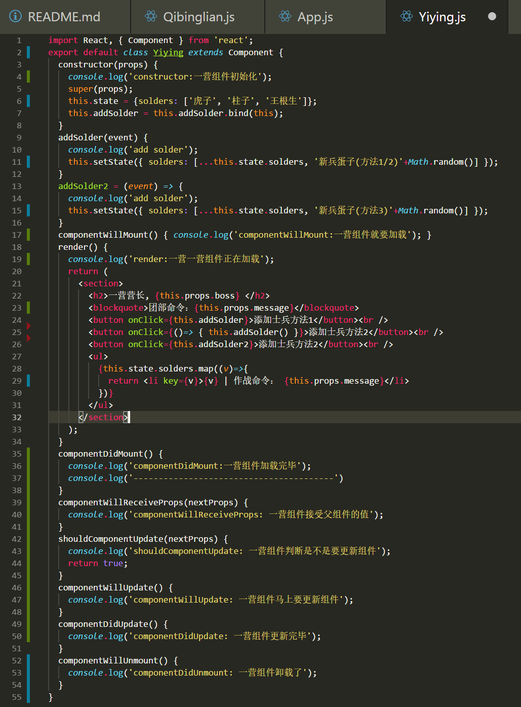
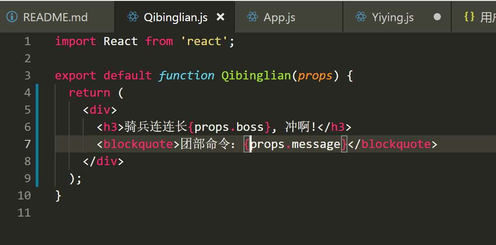
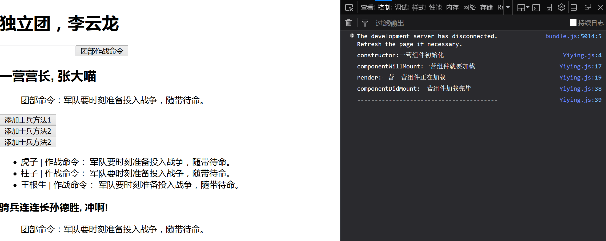
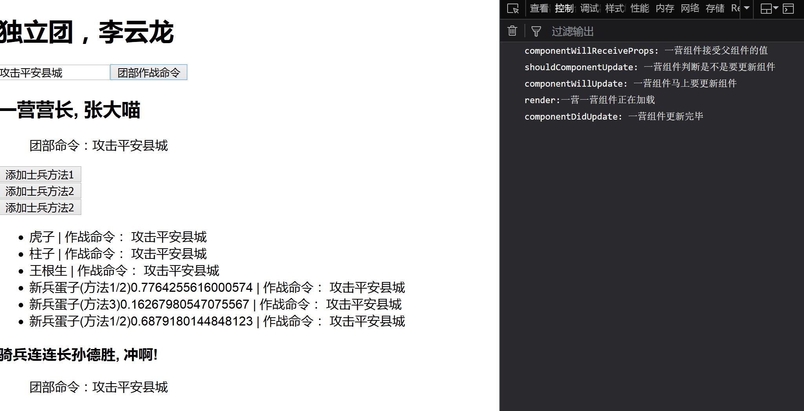
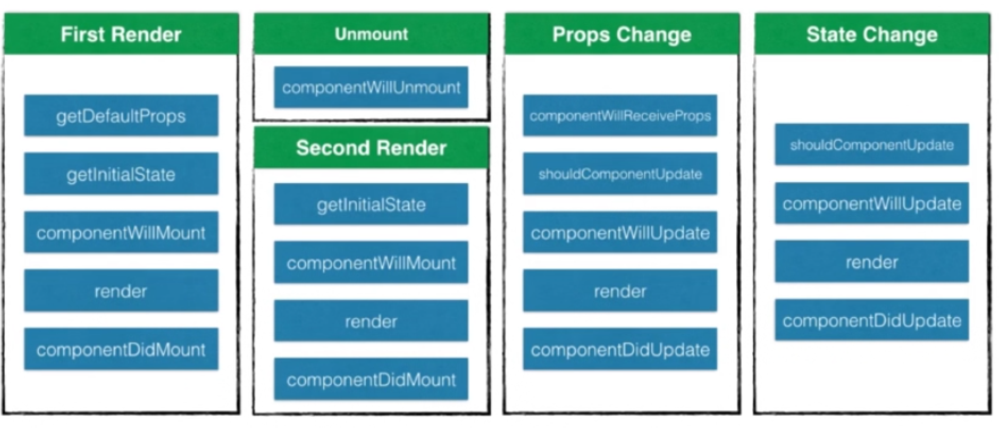
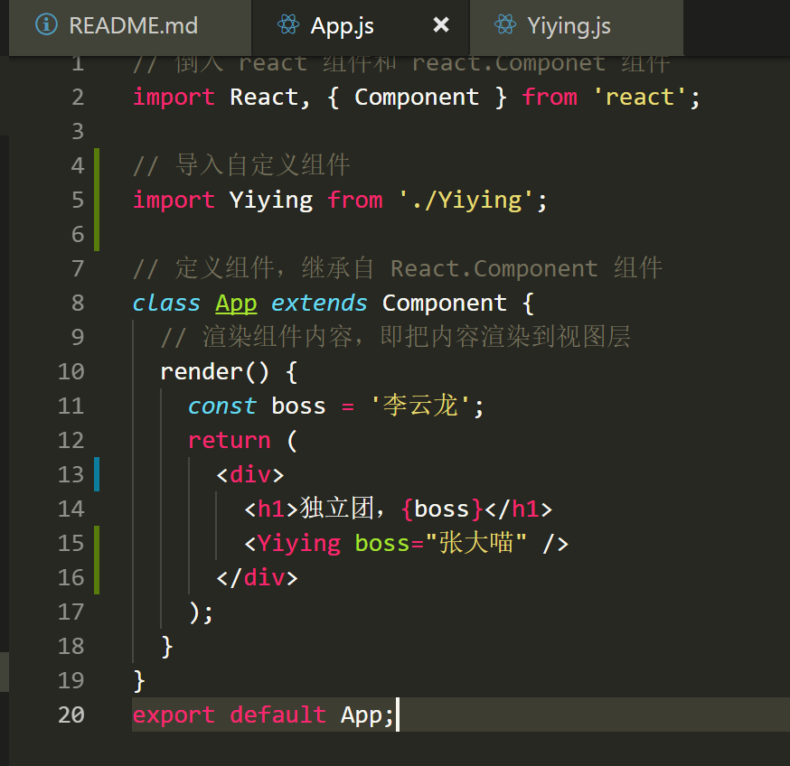
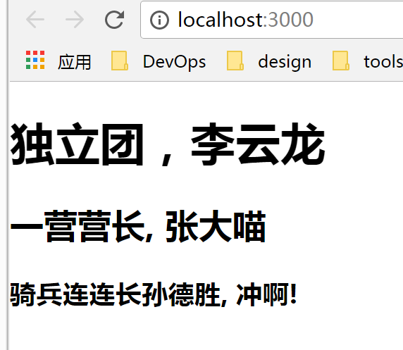
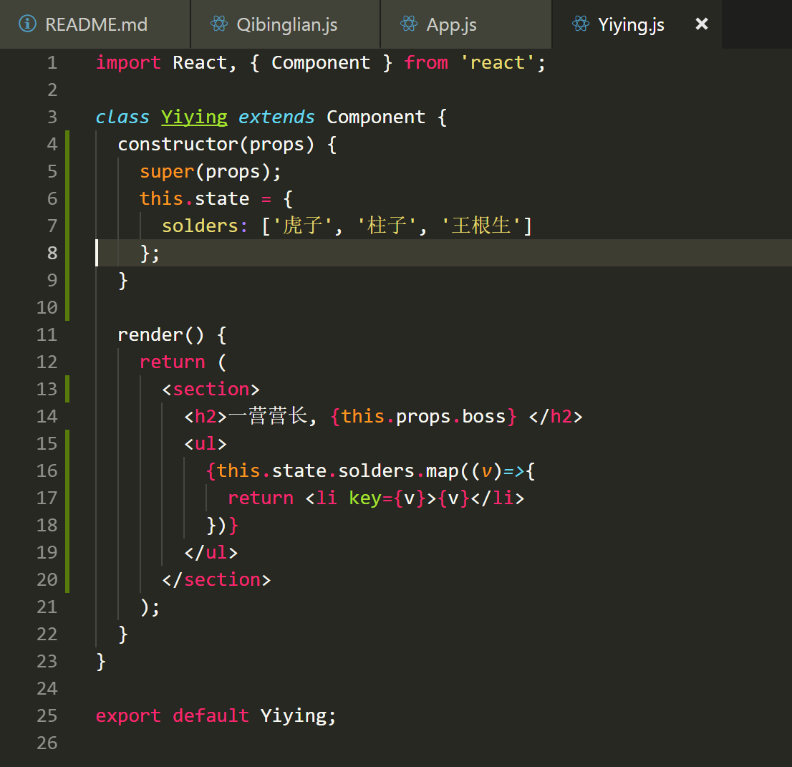
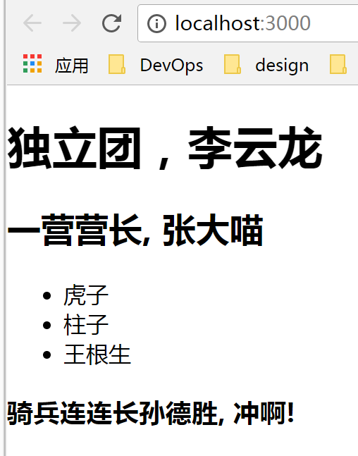

# sword

[父组件下达命令](../images/lifecycle-parent.png)

- 父组件: 输入命令并下达作战命令, `refs 属性`可以轻易获取　 DOM 　属性值

---

未下达命令之前：声明周期流程

下达攻击平安县城命令之后：声明周期流程

### 组件之间传递数据

> 组件之间用 props 传递数据

- 使用 `<Component data="values">` 的形式传递
- 组件里使用 `this.props` 获取值
- 如果组件只有 `render`函数，还可以用函数的形式写组件

函数也可以作为组件

## 组件内部 state

> 组件内部通过 state 管理状态

- JSX 本质就是 js,所以直接`数组.map` 渲染列表
- `Constructor` 设置初始状态，记得执行`super(props)`
- State 是不可变得对象，使用 `this.state` 获取

